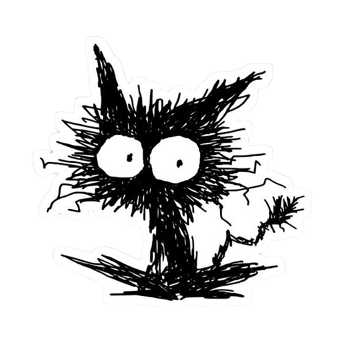

    
    

        <h3>Hey! I'm Luís</h3>
        
Passionate about technology and <b>code</b> since childhood.

        

            
            
        

    

   

    
I am 17 years old and currently studying system analysis and development, learning new <b>frameworks</b> to improve my projects.

    
I have already contributed to very popular open source projects write in <b>Kotlin</b>, like <a href="https://github.com/kordlib/kord">Kord</a>, which made me evolve as a programmer.

    
I sometimes tweet about tech-stuff. Feel free to reach me on <a href="https://www.linkedin.com/in/baskerbyte/">LinkedIn</a> about job-related matters.

    
🌟Looking for new things!

<h3>Skills</h3>

    

        <h4>Backend</h4>
        
        
        
        
        
    

    

        <h4>Frontend</h4>
        
        
        
    

    

        <h4>Database</h4>
        

            
            
            
        

    

    

        <h5>Hosting</h5>
        

            
            
        

    

<h3>Stats</h3>

  
  

